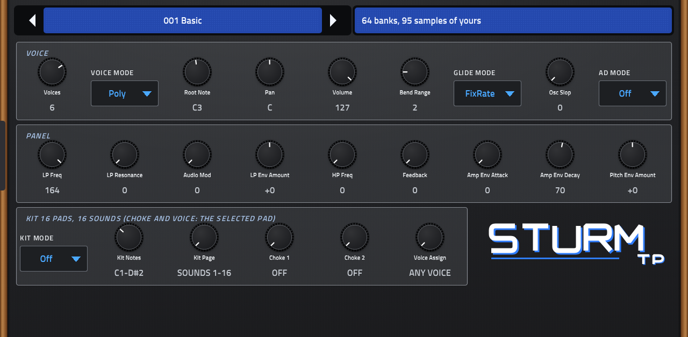

# Sturm-TP

A six-voice analog-style drum and synth voice for Akai MPC OS standalone devices (Force, MPC Live / One / X / Key), built as a
native VST2 instrument with its own screen skin and Q-Link pages. It plays the way the DSI Tempest's voice does: two analog
oscillators (saw, triangle, saw-tri, pulse) with sync and a sub oscillator, two sample oscillators that can bypass the filters,
a Curtis-style 2/4-pole low-pass that rings on its own, a 2-pole high-pass, feedback, five envelopes with delay and peak hold,
two LFOs and eight modulation paths. A sound is the instrument's own 127 fields, so Tempest sound and project dumps load as
they are.



*Sturm-TP (Sturm is German for storm) is an independent project, not affiliated with or endorsed by Dave Smith Instruments or Sequential.*

**Status: first device build.** Installed and played on a Force; it sounds right to the author's ear, but the analog parts
are modelled from circuits and not yet compared with an instrument. See [docs/STATUS.md](docs/STATUS.md).

## Install

1. Copy the `sd88me - VST - Sturm-TP` folder (the `.so` and its skin) to `Synths/` on the device's internal storage or a card.
2. Restart MPC and load **Sturm-TP** on an instrument track.
3. Optional: put your own `.syx` sound or project dumps in `SYSEX/` and WAVs or VS ROM chips in `SAMPLES/` (below).

Runs on MPC Live / One / X / Key and Force (armhf, glibc 2.27 or newer; tested on a Force only). It needs no extra files: it plays
its own bank and stand-in samples out of the box.

**CPU:** about 20 % of one audio block's time with eight voices sounding (peak 25 %). Sweeping Q-Links while stand-in samples are
built in the background can reach about 35 %. Use Kit mode to share the voices across 16 pads.

**Not in this release:** the sequencer, beat-wide settings, NRPN, and exporting sounds
as SysEx. The drum and percussion samples are stand-ins, not the original's.

## How it relates to the original

This is **not an emulation of the instrument's firmware**. It is a new engine built on the instrument's data model and on what
its firmware and manual say:

- **The sound format is the original's**: the 127 fields in their stored order and bit widths, read from the main OS's own
  descriptor table ([docs/FIRMWARE.md](docs/FIRMWARE.md)).
- **The control side follows the voice firmware**: the DCO pitch table, the envelopes' delay, peak and rate tables and their
  exponential segments, the LFO rates, glide and the modulation scaling, all at the voice CPU's 5 kHz control rate. The engine
  uses formulas and breakpoints fitted to them; no firmware data is in this repository or the plugin.
- **The analog half is modelled on its circuits** ([docs/ANALOG.md](docs/ANALOG.md)): reset-integrator DCOs with band-limited
  sync and sub, a CEM3320-style zero-delay-feedback cell cascade with in-tune self-oscillation (kernels shared with Morpho-PE via Morpho-PE's `analog/` header), high-pass, feedback and VCA. Not yet measured
  against an instrument.

## Your own sounds and samples

The plugin makes `SYSEX` and `SAMPLES` folders inside its own folder on first load.

- **Sounds**: put Tempest `.syx` files in `SYSEX` (or next to the plugin): sound dumps and project dumps (a project's sounds become
  banks of 128). Without files, a bank of this project's own sounds plays.
- **Leaving sounds out**: the **Sample Sounds** selector at the foot of the BANKS page (also a Q-Link there) leaves out the sounds of
  your sound dumps that play PCM samples, which this plugin has only stand-ins for: *All sounds* (default), *No drum samples* (keeps the
  sounds that use only the noises, which have good stand-ins) or *No samples*. Changing it rebuilds the bank list and loads the
  first sound of the same-named bank; it is saved with the project. Project dumps are never filtered: their beats are the kit layout.
  `SYSEX/import.txt` (written on first load) has `dedupe = on|off`: a sound identical in all 127 fields to one already loaded from an
  earlier file is left out, so a sound that is in two sets appears once.
- **Samples**: the instrument's samples are not in its OS files. Oscillators 3/4 start with stand-ins of this project's own (noises,
  drum and percussion one-shots, single-cycle waves), chosen by each slot's group and name. Replace any slot with a WAV in
  `SAMPLES`: `037 anything.wav` (slot number) or `909ish.wav` (slot name); a WAV with "cycles" in its name and one cycle between cue
  points fills the 96 wave slots (Prophet VS order) in turn.
  **Prophet VS wave ROM**: the digital oscillators' single-cycle waves are the Prophet VS's. If you have its program ROM chips (the two
  27256 images, or one 64 KB image) put them in `SAMPLES`; the 95 ROM waves then replace the wave slots, exactly as read (12-bit),
  and nothing from them is stored or shipped. The Arturia Prophet-VS V's `waverom.bin` (24 320 bytes, the same 95 waves) is accepted too. Which ROM wave belongs in which slot is only verified for the
  first three (sine, saw, square) and judged from the wave names above that: the ROM has 95 waves for 96 slots, so slots 0-4 take ROM waves 0-4, slot 5 is left to its stand-in (a guess) and slots 6-95 take ROM waves 5-94. `SAMPLES/vsmap.txt` (`<wave slot 0-95> <ROM wave 0-94 or -1>`
  per line) overrides it.
  The release ships the stand-ins that are plain signals as WAVs in `SAMPLES` (the ten noises, the sine and the 96 waves; the
  `standins/` folder, made by `tools/render_samples.c`) so you can open, edit or overwrite them. The plugin sounds the same without them.

## Using it

Seven tabs: **SOUND** (the sound stepper and name, the status line, the voice settings, a panel row of the most used controls, and the
kit: Kit Mode, Kit Notes, Kit Page, Choke 1/2 and Voice Assign), **BANKS** (two columns of banks (22 a page, a Bank Page control and Q-Links to turn it) and two columns of the browsed bank's
sounds: tap a bank to look at it, which loads nothing, tap a sound to load it; the Q-Links are bank, sound, page back and page on,
and the data wheel steps whichever is selected), **OSC** (oscillators 1-4), **FILTER** (low pass and its envelope, high pass,
feedback, amp, a drawing of the voice's signal path), **ENV** (amp, pitch, aux 1, aux 2 envelopes), **LFO**, **MODS** (eight paths).
Destinations and mod sources are pickers: tap one and choose from a grid grouped by kind. A note at the root note (C3 by default) plays the sound at its own pitch.

**Choke and Voice Assign** (SOUND tab, as the instrument's Misc screen): each pad can choke two other sounds of its beat (a closed hat cutting
the open one); they are read from a project dump's beats and editable per sound; Voice Assign pins a sound to one of the voices (set by hand).

**Kit mode** plays 16 sounds from one instance, as the instrument's pads play a beat's sounds: the 16 notes from Kit Notes (C1 =
MPC's first pad by default) play the bank's sounds of the Kit Page (1-16, 17-32, ...), each at its own pitch, sharing the voices.
Load a project dump and its beats' kits are the bank's pages (32 sounds a beat: A1-A16, then B1-B16). "On + Select" also makes the
last struck pad the sound you edit. Edits stay with their sound, and the saved project keeps the kit page's 16 sounds.

MIDI: notes, velocity, pitch bend, mod wheel (1), breath (2), foot pedal 1 (4) and 2 (12), volume (7), expression (11), sliders
1/2 position and pressure (16-19), sustain (64), channel and poly pressure, program change, bank select (32).

## Building

Needs a checkout of [mpc-vst-plugins](https://github.com/sd88me/mpc-vst-plugins) next to this repo, Python 3 and Docker.

```
tools/make_layout.sh                                         # params.json, src/patch_tab.h, the skin layout
../mpc-vst-plugins/tools/test_port.sh vst/vst.json           # offline host test (ASan)
../mpc-vst-plugins/tools/build_port.sh vst/vst.json          # armhf .so + skin
```

Engine tests: see the first lines of `test/test_engine.c`. Firmware tools: `tools/fw/tp_fw.py` (works on your own files).
